# 🤖 AI Pocket Agent

AI Pocket Agent is a full-stack AI-powered mobile assistant built with React Native and Expo.  
It provides secure authentication, real-time AI chat, image support, and persistent chat history using Firebase.

---

## 🚀 Features

- 🔐 Secure Google Authentication using Clerk  
- 💬 Real-time AI chat experience  
- 🖼️ Image upload support in chat  
- 🕘 Chat history management (view & delete chats)  
- 📱 Cross-platform support (Android & iOS via Expo)  
- 🧱 Production-ready architecture with Expo Router  
- 🔄 OTA updates using Expo EAS  

---

## 🛠️ Tech Stack

- Frontend: React Native, Expo, Expo Router  
- Authentication: Clerk (Google OAuth)  
- Backend: Firebase Firestore  
- Storage: Firebase Storage  
- AI Integration: Custom AI API  
- Version Control: Git & GitHub  

---

## 📸 Screenshots

### Welcome Screen

  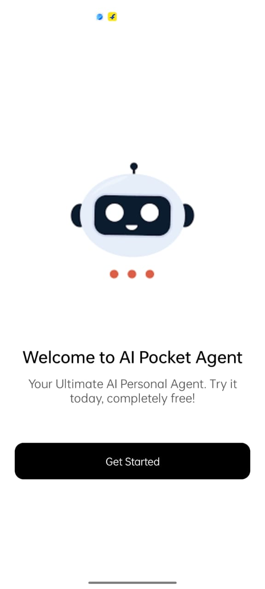

---

### Home Screens

  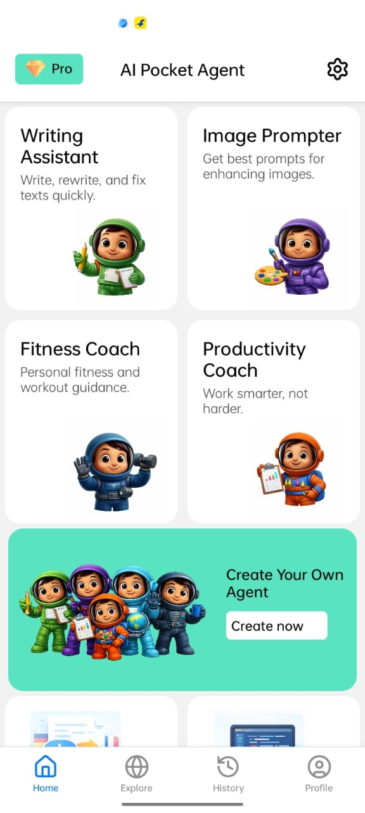
  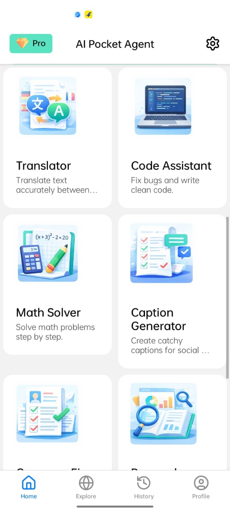

---

### Chat

  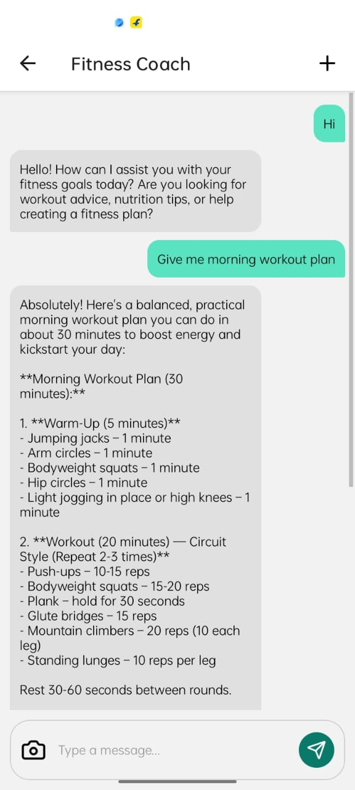

---

### Message Options

  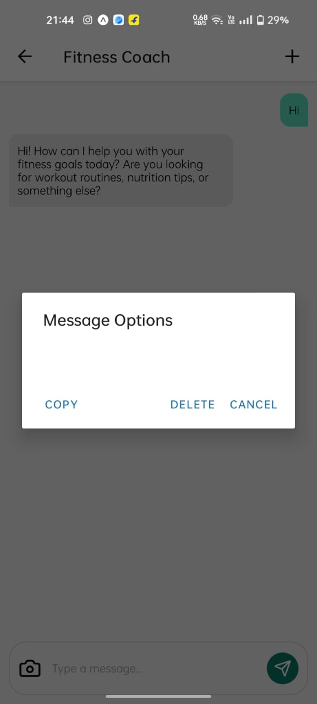

---

### History

  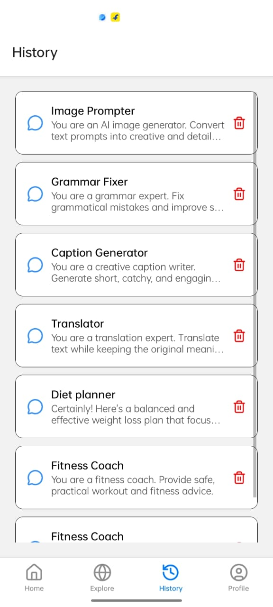

---

### Profile

  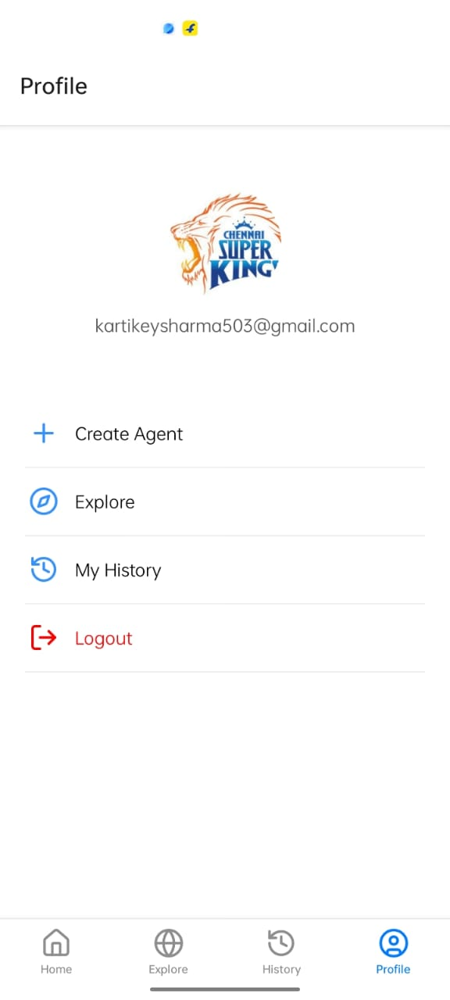

---

### My Agents

  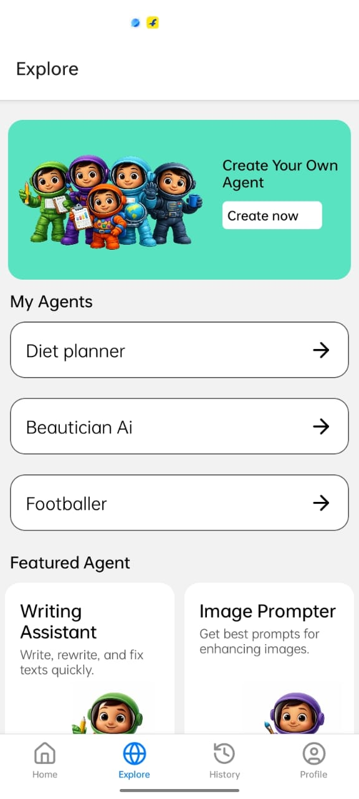

---

### Create Agent Flow

  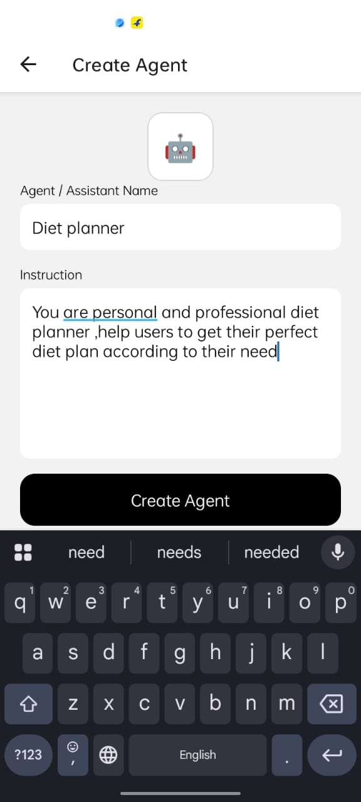
  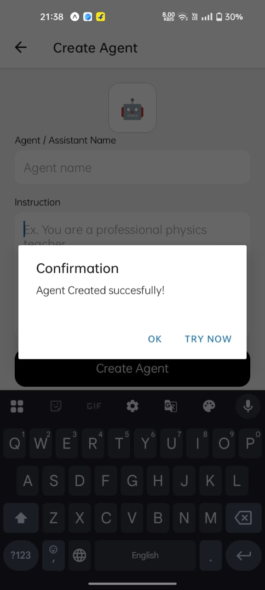
  

---

### Logout

  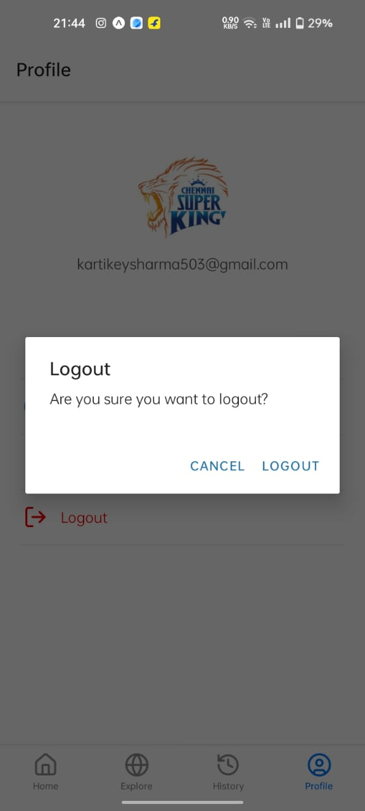

